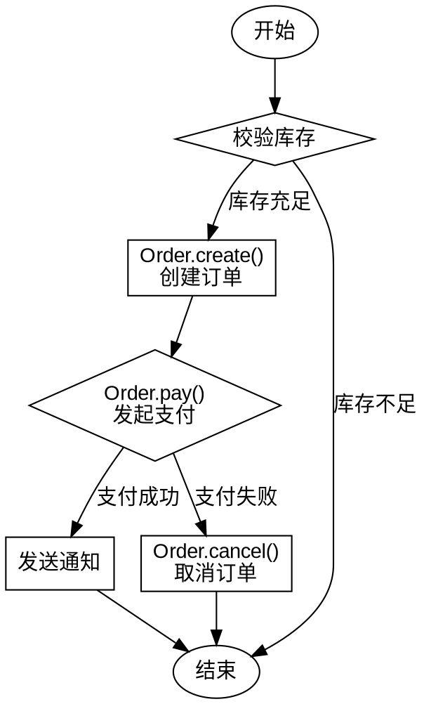

## 执行步骤
按以下顺序依次输出，不要省略任何一步。

## Step 1：涉及实体提取
实体是代码中出现的核心对象或概念（用户、订单、商品、角色、任务等）。

**输出格式：**

**实体名称** — 简短描述
- 行为/方法1：说明其作用
- 行为/方法2：说明其作用

示例：
**Order（订单）** — 表示一次用户购买记录
- create()：创建新订单，校验库存
- pay()：发起支付，修改状态为已支付
- cancel()：取消订单，触发退款流程

## Step 2：命名规则提取

提取代码中类、函数、变量、常量、接口、枚举等的命名风格，按类型分组列出。

**输出格式：**

| 类型 | 命名风格 | 示例 |
|------|----------|------|
| 类名 | PascalCase | `OrderService`, `UserRepo` |
| 函数/方法 | camelCase / snake_case | `getUser()` / `get_user()` |
| 变量 | camelCase / snake_case | `userId` / `user_id` |
| 常量 | UPPER_SNAKE_CASE | `MAX_RETRY`, `DEFAULT_TIMEOUT` |
| 接口/类型 | `I` 前缀 / `Type` 后缀 | `IUserService`, `OrderType` |
| 文件名 | kebab-case / snake_case | `order-service.ts` / `order_service.py` |

只列出代码中实际出现的类型，未出现的不列。

## Step 3：处理逻辑流程图

使用 **Graphviz DOT 语法** 描述处理流程，节点名称要对应 Step 1 中提取的实体和行为。

要求：
- 用中文标注节点和边
- 区分判断节点（菱形 `shape=diamond`）和处理节点（矩形）
- 标出主流程和异常/分支流程
- 用 `subgraph` 按实体分组（如果逻辑复杂）

输出示例：

## 输出结构

最终按此顺序输出：

1. **涉及实体**（Step 1 结果）
2. **命名规则**（Step 2 表格）
3. **处理流程图**（Step 3 DOT 代码块）