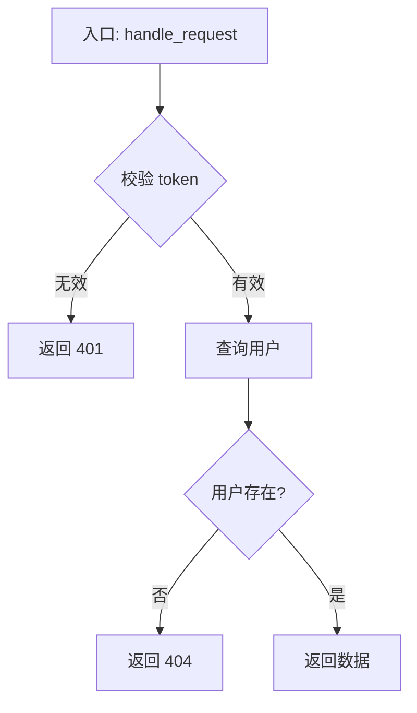

# 代码业务分析

## 分析目标

对给定代码进行业务层面的解读，输出三个维度：

1. **业务流程** — 代码执行的主干逻辑，以步骤或流转描述
2. **数据来源** — 重要数据从哪里获取（排除接口传参）
3. **实体行为** — 哪些实体（类/模块/服务）做了什么事


## 输出格式

### 一、业务流程
- 描述主干执行路径，聚焦"发生了什么"，忽略底层实现细节。
- 列出代码中的核心实体（类、服务、模块、数据表），描述它们分别做了什么

> 示例：
> 1. 读取任务队列，取出待处理记录
> 2. 调用汇率字典查询当日汇率
> 3. 按创作者维度聚合 GMV，写入汇总表

### 二、数据来源

列出代码中出现的**非传参数据来源**，说明每项数据的获取方式。

排除项：HTTP 接口入参、函数/方法的直接传参。
关注项：数据库查询、缓存读取、配置文件、外部 API 主动调用、文件读取、环境变量、字典表/维表等。

| 数据 | 来源类型 | 说明 |
|------|---------|------|
| 汇率 | 数据库字典表 | `dictGet` 从 ClickHouse 字典读取 |
| 任务状态 | 缓存 | Redis `GET task:{id}` |


## 输出格式
根据业务复杂度选择格式：
### 简单业务 → 编号步骤

```
1. 接收参数 user_id，校验非空
2. 查询数据库获取用户信息
3. 若用户不存在，抛出 404 异常
4. 返回格式化后的用户对象
```

### 复杂业务 → 步骤 + Mermaid 流程图

**流程说明：**
1. xxx
2. xxx

**流程图：**



## 分析原则

- **业务视角优先**：用业务语言描述，不逐行解释代码
- **聚焦主干**：忽略日志、异常处理等非核心逻辑
- **数据溯源要准确**：区分"被动接收的参数"和"主动获取的数据"
- **实体粒度适中**：不拆到每个变量，聚焦有独立职责的对象/资源