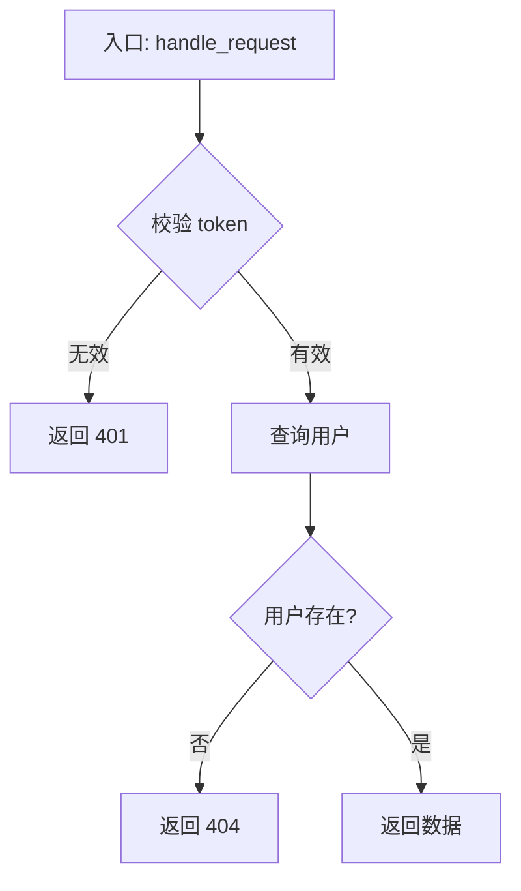

# Code Logic 分析 Skill

## 分析步骤

1. **识别入口**：找到主函数 / 接口入口 / 事件触发点
2. **梳理主流程**：按执行顺序列出核心步骤，忽略无关细节
3. **标注分支**：识别条件判断、异常处理、循环逻辑
4. **识别副作用**：数据库读写、外部调用、文件操作、状态变更
5. **总结意图**：用一句话说明这段代码的业务目的

## 输出格式

根据代码复杂度选择格式：

### 简单代码 → 编号步骤

```
1. 接收参数 user_id，校验非空
2. 查询数据库获取用户信息
3. 若用户不存在，抛出 404 异常
4. 返回格式化后的用户对象
```

### 复杂代码 → 步骤 + Mermaid 流程图

**流程说明：**
1. xxx
2. xxx

**流程图：**


## 输出原则

- **精简优先**：只描述做了什么，不解释为什么这样写
- **业务语言**：用业务术语描述，而非底层实现细节
- **突出异常路径**：分支、错误处理单独标注
- **长函数拆段**：超过 50 行的函数，按功能块分段描述
