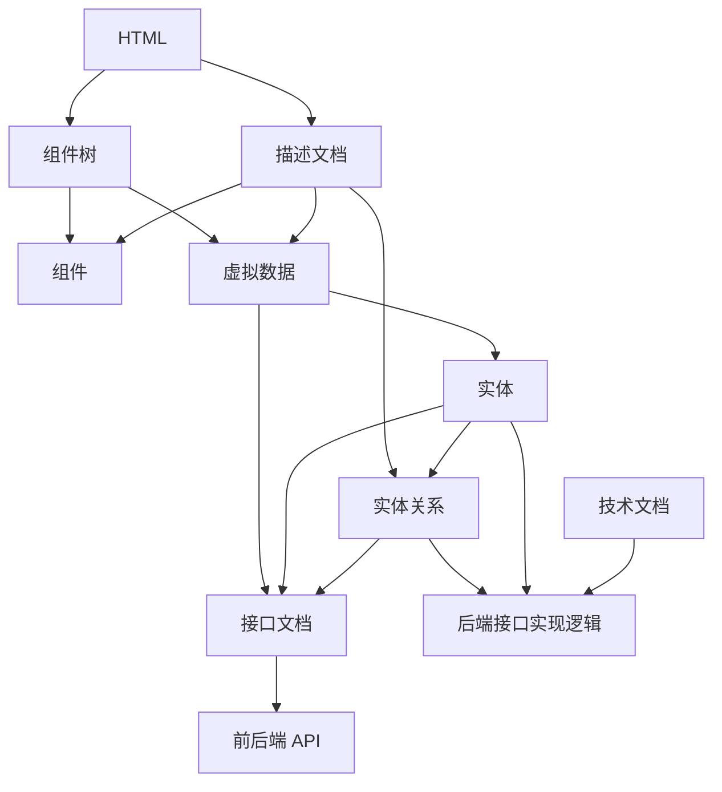

## 规划(plan)->执行(exe)->检验(check) 

## 相关目录
- 界面解析 `@docs/prototype`
- 接口文档 `@docs/api`
- 实体文档 `@docs/entity`
- DDL文档  `@docs/ddl`

## 工作流
- html
- 解析

- 组件+虚拟数据
- 实体
- 接口
- 事件,store

## 文档依赖关系

html -> 组件树 + 描述文档

组件树 + 描述文档 -> 组件 + 虚拟数据

虚拟数据 -> 实体 -> 实体描述文档(枚举字段, 字段范围等信息)

描述文档 + 实体 -> 实体关系

虚拟数据 + 实体 + 实体关系 -> 接口文档

接口文档 -> 前后端api

实体关系 + 实体 + 技术文档 -> 后端接口实现逻辑

